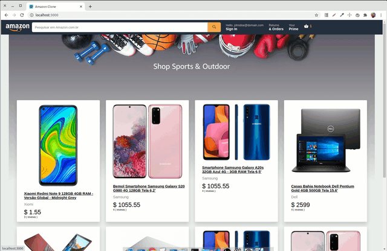

# Amazon Clone

# Tecnologias

- Javascript.
- React.
- React Context API.
- React Router.
- Styled Components.

# Como executar esse projeto.

1º Clone esse repositório:

`git clone https://github.com/apteles/ui-clone-amazon.git`

2º Entre na pasta ui-clone-amazon:

`cd ui-clone-amazon`

2º Instale as dependências do projeto:

`yarn install`

3º Agora execute o comando para iniciar:

`yarn start`

## Licença

